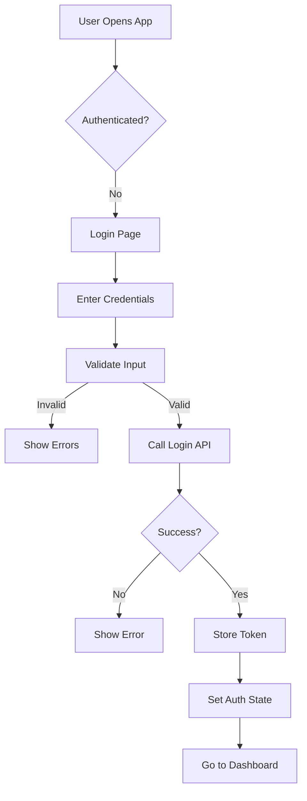

# Digital Asset Management & Media Intelligence Platform

## **1. Project Title**

Digital Asset Management & Media Intelligence Platform

---

## **2. Overview**

Organizations manage thousands to millions of digital assets such as images, videos, documents, marketing creatives, and brand materials. Today, these assets are scattered across shared drives, cloud folders, emails, and messaging tools. Teams often rely on folder naming conventions, manual tagging, and Excel sheets to track what exists, who owns it, and whether it can be used.

As the organization grows, assets are duplicated, lost, outdated, or misused. Finding the “right” version of an asset becomes slow and frustrating. Compliance risks increase when expired or unapproved assets are accidentally used in campaigns. Reporting on asset usage, performance, and compliance is largely manual and unreliable.

The current approach breaks down under scale because manual tagging, searching, and reporting cannot keep up with volume and frequency of uploads. Teams spend more time searching and validating assets than creating value.

The goal is to build a centralized platform that manages digital assets end-to-end, automates intelligence around content, and provides visibility into usage, compliance, and performance—without slowing down day-to-day operations.


## **3. Folder Structure**

```
DIGITA-ASSET-MANAGEMENT/
├── .husky/  # husky setup
├── Frontend/ # Front end (React app)
├── Backend/  # Backend App (node+express)
├── .dockerignore
├── .gitignore
├── commitlint.config.js
├── CONTRIBUTING.md
├── docker-compose.yml
├── HLD.drawoio
├── package.json
├── README.md

```
## **4. App folder**

 ```
 ├── Frontend/ # Front end (React app)
    ├── node_modeules
    ├── public
     ├── src
        ├── assets                      ( files, img , logo)
        ├── auth                        ( authentication logics)
        ├── components                  ( components)
        ├── context                     ( context, auth-context)
        ├── hooks                       ( custome hookes, pagination hook)
        ├── models                      ( type declearation)
        ├── pages                       ( layout pages)
        ├── reducers                    ( api call, reducers and actions, login, singin)
        ├── services                    ( API services, interceptors)
        ├── App.tsx                     ( main app, routes)
        ├── index.css
        ├── main.tsx
    ├── test
    ├── .env
    ├── .prettierignore
    ├── .prettierrc
    ├── dockerfile
    ├── eslint.config.js
    ├── index.html
    ├── ngnix.config
    ├── packege-lock.json
    ├── tsconfig.app.json
    ├── tsconfig.node.json
    ├── vite.config.ts

 ├── Backend/  # Backend App (node+express)
    ├── node_module
    ├── src
       ├── config                          ( DB configuration, Rabbit MQ config)
       ├── consumer                        ( Consumer, worker deligation )
       ├── controller                      ( controlers for admin, public, managers)
       ├── helper                          ( helpers for id generator, other)
       ├── middlewares                     ( authentication middleware)
       ├── models                          ( DB schema design and type initialization)
       ├── queuePublicer                   ( public tasks to queue)
       ├── router                          ( routes for admin, public, managers)
       ├── services                        ( services for API routes)
       ├── types                           ( type decleratons)
       ├── utilis                          ( utility folder, globle errror hander)
       ├── validation                      ( validation sanitize frontend payloads)
       ├── index.ts
       ├── server.ts
    ├── storage
    ├── test
    ├── .env.dev
    ├── .env.production
    ├── .prettierignore
    ├── .prettierrc
    ├── dockerfile
    ├── eslint.config.js
    ├── .dockerignore
    ├── packege-lock.json
    ├── tsconfig.app.json
    ├── tsconfig.node.json
    ├── vite.config.ts
 ```


## **5. Installation & Setup**

```
# 1. Clone & Install
git clone https://github.com/rishab-mindfire/Digital-Asset-Management
cd Digital-Asset-Management
```

## env file example

```
# frontend
VITE_BASE_URL=http://localhost:4001
VITE_TOKEN_KEY='File-System'

# backend
PORT=4001
FRONTEND_URL="http://localhost:3001"
DB_CONNECTION_STRING="mongodb://localhost:27017/asset-management"
JWT_SECRET=""
JWT_REFRESH_SECRET=""
UPLOAD_DIR="./storage/raw"
RABBITMQ_URL="amqp://127.0.0.1:5672"
QUEUE_UPLOAD_ASSET_NAME="asset_upload_processing"
RABBITMQ_THUMBNAILPATH="storage/thumbnails"
EXPIRY_DAYS=1


```

 ## Setup and run app
 ````
# 1. installation forntend
   cd Frontend
   npm i

   # 2. Run frontend
   npm run dev

# 3. setup docker for rabbit MQ run
   (open in other terminal start docker by : )

   docker run -it --rm --name rabbitmq -p 5672:5672 -p 15672:15672 rabbitmq:4-management
   (make sure rabbit mq is running on correct port else create env for port)

# 4. installation backend
   cd Backend
   npm i

# 2. Run backend
   npm run dev                 (for dev mood)
   npm run prod                (for production mood)

 ````


## **6. Scripts**

| Command         | Description        |
| --------------- | ------------------ |
| `npm run dev`   | Development server |
| `npm run build` | Production build   |
| `npm run test`  | Run tests          |


## Testing

```bash
npm run test      # All tests (before test went to frontend, backend folders )
```


| Category     | Technology                     |
| ------------ | ------------------------------ |
| **Frontend** | React 19 + TypeScript          |
| **State**    | useReducer + Context API       |
| **Routing**  | React Router                   |
| **HTTP**     | Axios                          |
| **Styling**  | CSS Modules                    |
| **Testing**  | Vitest + React Testing Library |

## **7. System Architecture**



